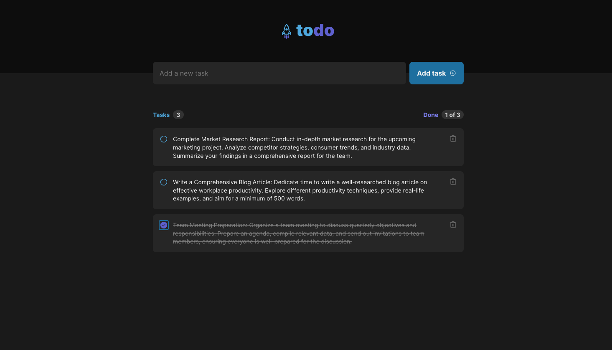

### Challenge 01 - Practicing ReactJS concepts



#### 💻 Getting started

To-do list-based application created with Vite + React.

Follow the steps below:
```bash
# Project dependencies
$ npm i

# Start the app
$ npm run dev
```

The application will be initialized on the port: `5173`

#### 🔗 Challenge link
https://efficient-sloth-d85.notion.site/Desafio-01-Praticando-os-conceitos-do-ReactJS-91fd63dd1a5b4a2796152de293ec1074
